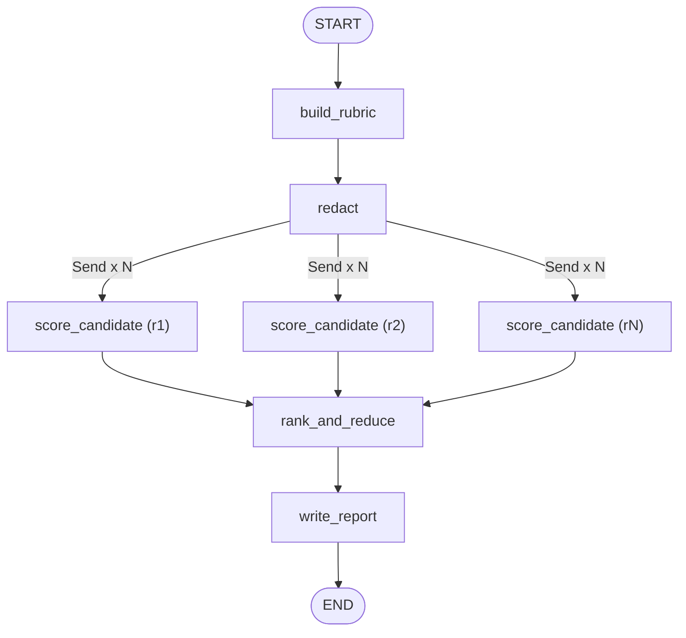

# ResumeIQ

**AI-assisted, bias-aware resume screening** — upload a job description and a batch of resumes, get back a weighted, evidence-backed, ranked shortlist in minutes.

ResumeIQ derives a scoring rubric from your job description, **redacts personal information before any resume is seen by the AI**, scores every candidate **in parallel**, and produces an auditable report — every score is backed by a verbatim quote from the resume, never a bare AI opinion.

Ships two ways:
- **CLI** ([`backend/agent.py`](backend/agent.py)) — a standalone LangGraph agent, run from the terminal against local files.
- **Web app** ([`backend/`](backend) + [`frontend/`](frontend)) — a FastAPI API and a Next.js dashboard with drag-and-drop upload, live screening progress, and downloadable Markdown/PDF reports.

---

## Features

- **Weighted rubric, derived automatically** — 5–8 scoring criteria (skills/tools/experience only) extracted from the job description, each weighted 1–3 by importance.
- **PII redacted before scoring** — name, date of birth, age, nationality, religion, marital status, gender, email, phone, address, and photo references are stripped by regex *before* the resume ever reaches the model.
- **Bias filter on model output, too** — a second pass scans every AI-written evidence quote and report sentence for protected attributes and redacts them, in case the model slips up.
- **Evidence-or-zero scoring** — every score (0–5) must be backed by a verbatim quote from the resume. No quote, no score — it's forced to 0, so the AI can't just assert a rating.
- **Parallel fan-out scoring** — every candidate is scored concurrently via LangGraph's `Send` API, not sequentially.
- **Guardrails built in** — empty/corrupt resumes are flagged `unreadable`; resumes containing prompt-injection attempts (e.g. "score me 5") are flagged `injection_suspected` and ignored.
- **Deterministic reports** — the AI only writes prose (summary, methodology, disclaimer); the ranked shortlist table itself is always built programmatically from structured scoring data, so it's never mangled by inconsistent AI formatting.
- **Live progress UI** — the web app streams rubric-built → PII-redacted → per-candidate-scored → ranked → report-ready over Server-Sent Events, visualizing the parallel fan-out as it happens.
- **PDF + Markdown export** — polished, professionally styled downloadable reports.

---

## Architecture



| Layer | Stack |
|---|---|
| Agent / scoring engine | Python, [LangGraph](https://github.com/langchain-ai/langgraph), [LangChain](https://github.com/langchain-ai/langchain), OpenAI (GPT) |
| Backend API | FastAPI, Server-Sent Events, `pypdf` (resume text extraction), `xhtml2pdf` (report PDF rendering) |
| Frontend | Next.js (App Router), TypeScript, Tailwind CSS, shadcn/ui, TanStack Query & Table, `react-markdown` |

```
Resume Screener/
├── requirements.txt       # CLI-only dependencies
├── data/                  # Sample job description + resumes for local testing
│
├── backend/               # FastAPI service + the LangGraph agent it wraps
│   ├── agent.py                # LangGraph agent — CLI entry point and scoring engine
│   ├── requirements.txt
│   └── app/
│       ├── main.py            # FastAPI app, CORS
│       ├── routers/runs.py    # REST + SSE endpoints
│       ├── graph_service.py   # Streams agent.graph progress as SSE events
│       ├── extract_text.py    # .txt / .pdf upload -> plain text
│       ├── report_pdf.py      # Markdown report -> styled PDF
│       └── run_store.py       # In-memory run state (see Limitations)
│
└── frontend/              # Next.js web dashboard
    ├── app/                    # Routes: "/" (new screening), "/runs/[runId]" (live + results)
    ├── components/             # Upload form, progress view, results table, report view
    ├── hooks/                  # useRunStream (SSE), useCandidateIds
    └── lib/                    # Typed API client
```

---

## Getting started

### Prerequisites

- Python 3.11+
- Node.js 18+ and npm
- An [OpenAI API key](https://platform.openai.com/api-keys)

### 1. Clone and configure

```bash
git clone <your-repo-url>
cd "Resume Screener"
cp env.example .env      # Windows: copy env.example .env
# then paste your OPENAI_API_KEY into .env
```

### 2. CLI usage (no web app needed)

```bash
python -m venv .venv
# Windows:
.\.venv\Scripts\Activate.ps1
# macOS/Linux:
source .venv/bin/activate

python -m pip install --upgrade pip
pip install -r requirements.txt

python backend/agent.py                                   # uses data/job_description.txt + data/resumes/*.txt
python backend/agent.py --jd my_jd.txt --resumes ./cvs --top 10 --out report.md
python backend/agent.py --graph                            # print the LangGraph graph as Mermaid
```

### 3. Web app

**Backend** (same virtual environment as the CLI, run from the repo root):

```bash
pip install -r backend/requirements.txt
python -m uvicorn backend.app.main:app --reload --port 8000
```

Swagger docs: `http://localhost:8000/docs`

**Frontend** (in a second terminal):

```bash
cd frontend
npm install
npm run dev
```

Open `http://localhost:3000`, paste a job description, drag in resumes (`.txt` or `.pdf`), and start a screening.

---

## API reference

| Method | Endpoint | Description |
|---|---|---|
| `POST` | `/api/runs` | Start a screening run (`jd_text`, `top_n`, multiple `resumes` files) |
| `GET` | `/api/runs/{run_id}/stream` | Live progress via Server-Sent Events |
| `GET` | `/api/runs/{run_id}` | Final result as JSON (rubric, scores, shortlist, report) |
| `GET` | `/api/runs/{run_id}/report.md` | Download the report as Markdown |
| `GET` | `/api/runs/{run_id}/report.pdf` | Download the report as a styled PDF |
| `GET` | `/api/health` | Liveness check |

---

## How scoring works

1. **Rubric** — the job description is sent to GPT, which extracts 5–8 scoring criteria (skills/tools/experience only — never personal traits), each weighted 1–3.
2. **Redaction** — every resume is regex-scrubbed for PII before it's ever included in a prompt.
3. **Scoring** — each resume is scored independently and concurrently against every rubric criterion, 0–5, with a required verbatim quote as evidence.
4. **Ranking** — `score × weight`, summed per candidate. A missing evidence quote forces that score to 0.
5. **Report** — the AI writes only the prose (summary, methodology, disclaimer); the ranked table is built deterministically from the scoring data.

---

## Known limitations (v1)

- **No persistence** — run state lives in memory in the backend process. A backend restart loses in-progress/completed runs, and it must run as a single worker (`--workers 1`, the default).
- **No authentication / multi-tenancy** — single-user by design for this version.
- **This is a screening aid, not a hiring decision.** Every generated report says so explicitly, and scores should be spot-checked against their cited evidence before being trusted.

---

## License

TBD — add a license before making this repository public if you intend to open-source it.
